# JR Logistics Platform Guide: Required Fields & 45 Visual Flows (With Start, Choice, and End Diagrams)

> **Purpose of this Document:** A complete, visual, plain-English operational guide covering:
> 1. **Part 1:** Information Needed to Add a Warehouse
> 2. **Part 2:** Information Needed to Deal with a Courier Office & Its Fleet
> 3. **Part 3:** Core Order Lifecycle Flows (**Flows 1 to 26** — Creation, Matching, Loading, Delivery, Completed, Cancelled, and Returned) — **Every flow includes a simple Start / Choice / End diagram**
> 4. **Part 4:** All Platform Management, Fleet, Support & Financial Flows (**Flows 27 to 45**) — **Every flow includes a simple Start / Choice / End diagram**

---

## Part 1: Information Needed to Add a Warehouse

### 1.1 Account & Contact Person Details
* **Representative Full Name:** Main person managing the warehouse account.
* **Official Mobile Number:** Verified by SMS code (used for login and urgent alerts).
* **Official Email Address:** Used for tax invoices and billing statements.
* **Primary Operating City & Preferred Language:** (Arabic, English, or Urdu).

### 1.2 Legal & Location Details
* **Company Trade Name (Arabic & English):** Matching the Commercial Registration.
* **Business Sector / Industry:** Retail, Food, Pharmacy, Electronics, Wholesale, etc.
* **Commercial Registration (CR) Number:** 10-digit official number.
* **VAT Tax Number:** 15-digit tax number (for ZATCA tax invoices).
* **Full National Address:** Short code, building number, street, district, and postal code.
* **Loading Dock Map Pin (GPS):** Exact gate pin so the system can verify driver arrival within 500 meters.
* **Loading Dock Supervisor Name & Mobile:** Direct contact for arriving drivers.

### 1.3 Required Official Documents
1. **Commercial Registration (CR) Copy**
2. **VAT Tax Registration Certificate**
3. **National Address Certificate**

### 1.4 Wallet, Negative Credit Limit & Contract Rules
* **Billing Type:** Prepaid Wallet OR Postpaid Negative Wallet (with an approved credit limit, e.g., **-50,000 SAR**).
* **Billing Cycle & Grace Period:** Weekly, 15-Day, or Monthly billing, plus a grace period (e.g., 5 days) before overdue accounts are automatically paused.
* **Agreed Package Size Standards:** Agreed upfront in the contract (warehouses do not enter weight/size per order).
* **Approved Delivery Zones & Out-of-Zone Penalty Fee:** Zones covered by the contract and the penalty charged if an out-of-zone address is slipped in.
* **Loading Dock Free Waiting Time (60 mins) & Delay Penalty:** Protects drivers from long dock waits.
* **Repeated Unreadiness Fee:** Applied if a warehouse fails to have its booked packages ready more than twice a week.
* **Driver Show-Up Compensation Fee:** Paid to the driver if the warehouse cancels after the driver arrives at the gate.

---

## Part 2: Information Needed to Deal with a Courier Office & Its Fleet

### 2.1 Courier Office Legal & Contact Details
* **Courier Office Trade Name, 10-Digit CR Number, TGA Transport License Number, and 15-Digit VAT Number.**
* **Operating City, Covered Zones, and National Address.**
* **Fleet / Operations Manager Name, Mobile & Email:** Responsible for assigning drivers and handling emergency replacements.

### 2.2 Bank & Payout Details
* **Bank Name, Official Beneficiary Name, and Saudi IBAN (24 characters starting with SA).**
* **Payout Rule:** 100% of earnings from office-linked drivers go directly to the **Courier Office's Wallet**.

### 2.3 Commercial Agreement Terms
* **Agreed Rate Card:** Payout per package (or per day) for each vehicle type (Sedan, Dokker, Hiace, Van, Dyna — Dry or Refrigerated).
* **Emergency Replacement Commitment:** If an office driver breaks down or has an emergency mid-shift, the **same office must send a replacement vehicle/driver within 45–60 minutes**.
* **Required Office Documents:** Commercial Registration (CR), TGA Transport License, and Bank IBAN Certificate.

### 2.4 Driver & Vehicle Fields
* **Driver Info:** Full Name, Mobile Number, National ID / Iqama, City, and Affiliation (**Linked to an Office** vs **Independent Freelancer**).
* **Vehicle Info:** Vehicle Type (Sedan, Dokker, Hiace, Van, Dyna), Cooling Type (Dry or Cold), Plate Number, **Maximum Package Capacity**, and Services Offered.
* **Driver Documents (Checked Daily for Expiry):** National ID/Iqama, Driving License, Vehicle Registration (Istimara), and Vehicle Photo.

---

## Part 3: Core Order Flows (Flows 1 to 26 — With Start, Choice, and End Diagrams)

### Flow 1: Master End-to-End Order Overview
A high-level view of how an order starts, branches based on what happens on the ground, and ends.

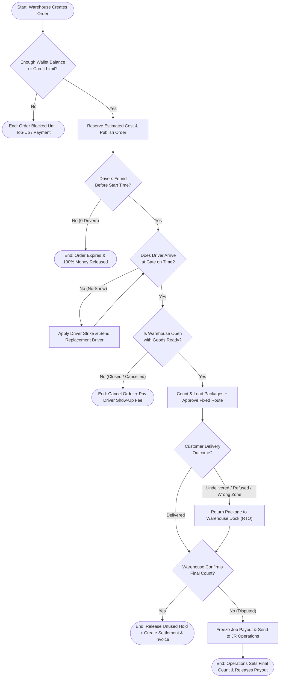
```mermaid
flowchart TD
    Start(["Start: Warehouse Creates Order"]) --> CreditCheck{"Enough Wallet Balance\nor Credit Limit?"}
    CreditCheck -->|"No"| EndReject(["End: Order Blocked Until Top-Up / Payment"])
    CreditCheck -->|"Yes"| Hold["Reserve Estimated Cost & Publish Order"]
    Hold --> Matched{"Drivers Found\nBefore Start Time?"}
    Matched -->|"No (0 Drivers)"| EndExpired(["End: Order Expires & 100% Money Released"])
    Matched -->|"Yes"| GateArrival{"Does Driver Arrive\nat Gate on Time?"}
    GateArrival -->|"No (No-Show)"| Replace["Apply Driver Strike & Send Replacement Driver"]
    Replace --> GateArrival
    GateArrival -->|"Yes"| DockReady{"Is Warehouse Open\nwith Goods Ready?"}
    DockReady -->|"No (Closed / Cancelled)"| EndShowUp(["End: Cancel Order + Pay Driver Show-Up Fee"])
    DockReady -->|"Yes"| Load["Count & Load Packages + Approve Fixed Route"]
    Load --> Deliver{"Customer Delivery\nOutcome?"}
    Deliver -->|"Delivered"| Confirm{"Warehouse Confirms\nFinal Count?"}
    Deliver -->|"Undelivered / Refused / Wrong Zone"| ReturnDock["Return Package to Warehouse Dock (RTO)"]
    ReturnDock --> Confirm
    Confirm -->|"Yes"| EndSuccess(["End: Release Unused Hold + Create Settlement & Invoice"])
    Confirm -->|"No (Disputed)"| OpsRule["Freeze Job Payout & Send to JR Operations"]
    OpsRule --> EndDispute(["End: Operations Sets Final Count & Releases Payout"])
```

---

### Flow 2: Creating an Order & Credit Limit Check
When a warehouse creates a new order, the platform checks its account verification and Negative Wallet credit limit before publishing.

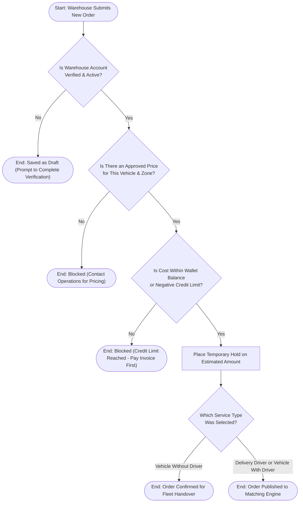
```mermaid
flowchart TD
    Start(["Start: Warehouse Submits New Order"]) --> Verified{"Is Warehouse Account\nVerified & Active?"}
    Verified -->|"No"| EndUnverified(["End: Saved as Draft (Prompt to Complete Verification)"])
    Verified -->|"Yes"| PriceRule{"Is There an Approved Price\nfor This Vehicle & Zone?"}
    PriceRule -->|"No"| EndNoPrice(["End: Blocked (Contact Operations for Pricing)"])
    PriceRule -->|"Yes"| Credit{"Is Cost Within Wallet Balance\nor Negative Credit Limit?"}
    Credit -->|"No"| EndNoCredit(["End: Blocked (Credit Limit Reached - Pay Invoice First)"])
    Credit -->|"Yes"| Reserve["Place Temporary Hold on Estimated Amount"]
    Reserve --> ServiceChoice{"Which Service Type\nWas Selected?"}
    ServiceChoice -->|"Vehicle Without Driver"| EndRental(["End: Order Confirmed for Fleet Handover"])
    ServiceChoice -->|"Delivery Driver or Vehicle With Driver"| EndPub(["End: Order Published to Matching Engine"])
```

---

### Flow 3: Multi-Vehicle Request (All-or-Nothing Bundle vs. Partial Acceptance)
When a warehouse needs multiple vehicles (e.g., 5 Dyna trucks), they tick a checkbox to decide how slots can be accepted.

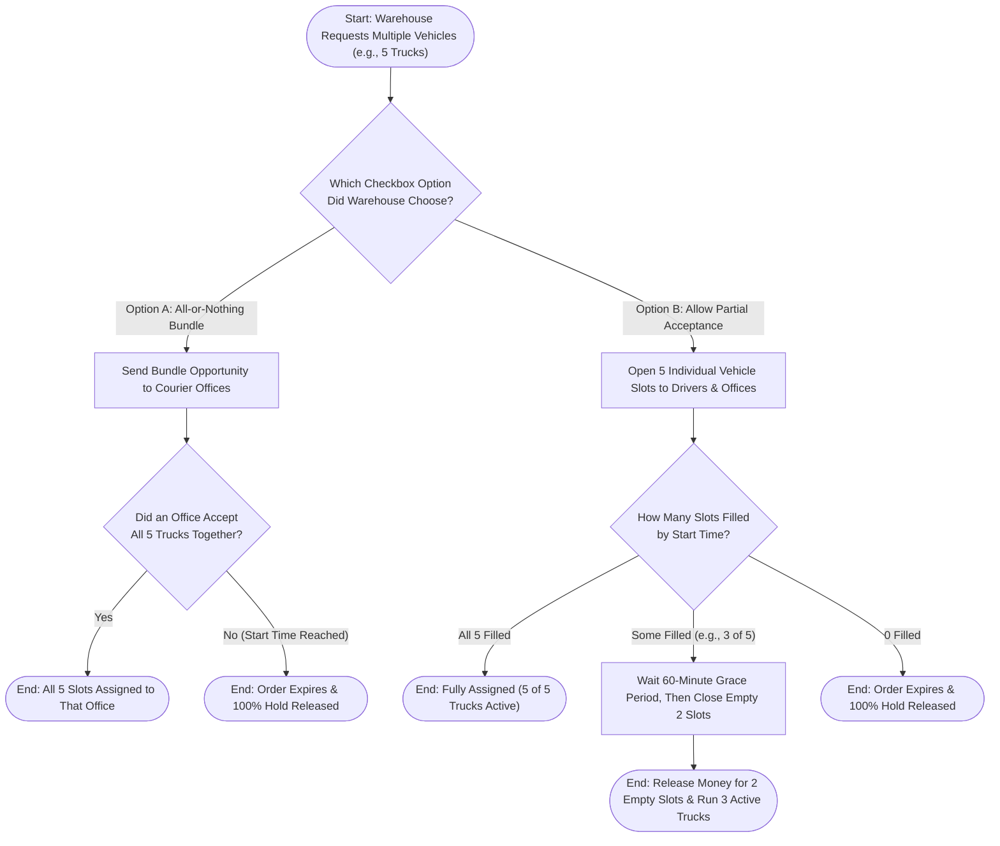
```mermaid
flowchart TD
    Start(["Start: Warehouse Requests Multiple Vehicles (e.g., 5 Trucks)"]) --> ModeChoice{"Which Checkbox Option\nDid Warehouse Choose?"}
    ModeChoice -->|"Option A: All-or-Nothing Bundle"| BundleOffer["Send Bundle Opportunity to Courier Offices"]
    BundleOffer --> BundleTaken{"Did an Office Accept\nAll 5 Trucks Together?"}
    BundleTaken -->|"Yes"| EndBundleAssigned(["End: All 5 Slots Assigned to That Office"])
    BundleTaken -->|"No (Start Time Reached)"| EndBundleExpired(["End: Order Expires & 100% Hold Released"])
    
    ModeChoice -->|"Option B: Allow Partial Acceptance"| PartialOffer["Open 5 Individual Vehicle Slots to Drivers & Offices"]
    PartialOffer --> SlotCount{"How Many Slots Filled\nby Start Time?"}
    SlotCount -->|"All 5 Filled"| EndFull(["End: Fully Assigned (5 of 5 Trucks Active)"])
    SlotCount -->|"Some Filled (e.g., 3 of 5)"| Grace["Wait 60-Minute Grace Period, Then Close Empty 2 Slots"]
    Grace --> EndPartial(["End: Release Money for 2 Empty Slots & Run 3 Active Trucks"])
    SlotCount -->|"0 Filled"| EndZero(["End: Order Expires & 100% Hold Released"])
```

---

### Flow 4: Smart Driver Matching & Eligibility Check
How the platform decides which drivers and offices can see and take an order (no "Preferred Office" favoritism).

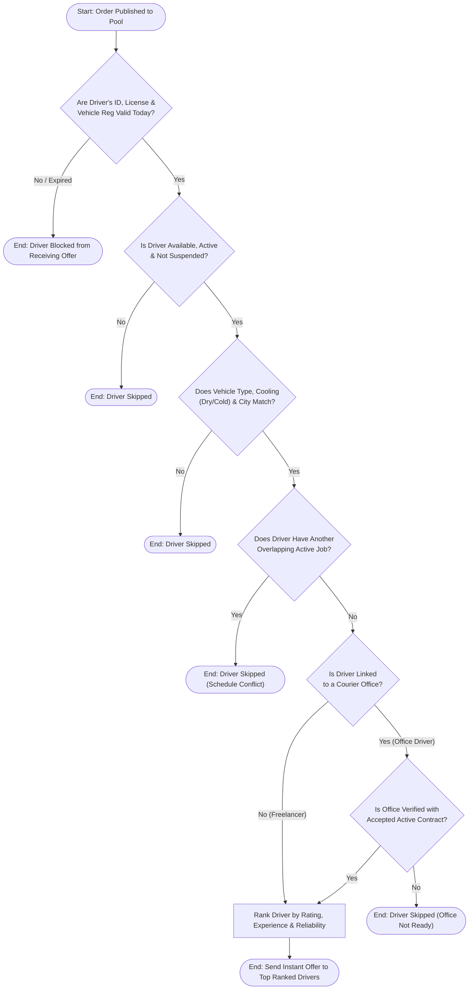
```mermaid
flowchart TD
    Start(["Start: Order Published to Pool"]) --> CheckDocs{"Are Driver's ID, License &\nVehicle Reg Valid Today?"}
    CheckDocs -->|"No / Expired"| EndIneligible1(["End: Driver Blocked from Receiving Offer"])
    CheckDocs -->|"Yes"| CheckStatus{"Is Driver Available, Active\n& Not Suspended?"}
    CheckStatus -->|"No"| EndIneligible2(["End: Driver Skipped"])
    CheckStatus -->|"Yes"| CheckVehicle{"Does Vehicle Type, Cooling\n(Dry/Cold) & City Match?"}
    CheckVehicle -->|"No"| EndIneligible3(["End: Driver Skipped"])
    CheckVehicle -->|"Yes"| CheckSchedule{"Does Driver Have Another\nOverlapping Active Job?"}
    CheckSchedule -->|"Yes"| EndIneligible4(["End: Driver Skipped (Schedule Conflict)"])
    CheckSchedule -->|"No"| CheckOffice{"Is Driver Linked\nto a Courier Office?"}
    CheckOffice -->|"No (Freelancer)"| Score["Rank Driver by Rating, Experience & Reliability"]
    CheckOffice -->|"Yes (Office Driver)"| OfficeReady{"Is Office Verified with\nAccepted Active Contract?"}
    OfficeReady -->|"No"| EndIneligible5(["End: Driver Skipped (Office Not Ready)"])
    OfficeReady -->|"Yes"| Score
    Score --> EndOffer(["End: Send Instant Offer to Top Ranked Drivers"])
```

---

### Flow 5: Offline Driver Comes Online (Instant Offer Backfill)
What happens when an order is waiting for drivers and a qualified driver opens the app and goes online.

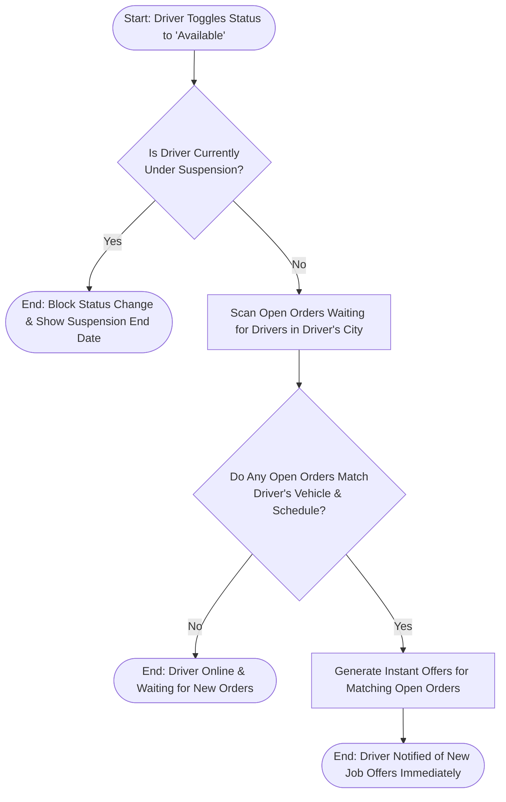
```mermaid
flowchart TD
    Start(["Start: Driver Toggles Status to 'Available'"]) --> Suspended{"Is Driver Currently\nUnder Suspension?"}
    Suspended -->|"Yes"| EndBlocked(["End: Block Status Change & Show Suspension End Date"])
    Suspended -->|"No"| ScanOpen["Scan Open Orders Waiting for Drivers in Driver's City"]
    ScanOpen --> MatchFound{"Do Any Open Orders Match\nDriver's Vehicle & Schedule?"}
    MatchFound -->|"No"| EndWait(["End: Driver Online & Waiting for New Orders"])
    MatchFound -->|"Yes"| PushOffers["Generate Instant Offers for Matching Open Orders"]
    PushOffers --> EndNotified(["End: Driver Notified of New Job Offers Immediately"])
```

---

### Flow 6: Driver Arrival & 500m GPS Gate Check-In
How the platform verifies that the driver physically arrived at the warehouse loading gate on time.

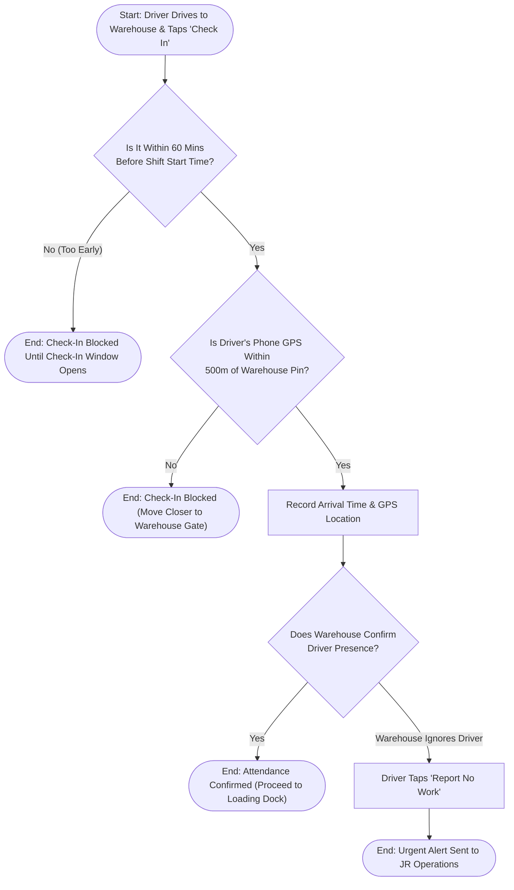
```mermaid
flowchart TD
    Start(["Start: Driver Drives to Warehouse & Taps 'Check In'"]) --> TimeCheck{"Is It Within 60 Mins\nBefore Shift Start Time?"}
    TimeCheck -->|"No (Too Early)"| EndEarly(["End: Check-In Blocked Until Check-In Window Opens"])
    TimeCheck -->|"Yes"| GpsCheck{"Is Driver's Phone GPS Within\n500m of Warehouse Pin?"}
    GpsCheck -->|"No"| EndFar(["End: Check-In Blocked (Move Closer to Warehouse Gate)"])
    GpsCheck -->|"Yes"| MarkArrived["Record Arrival Time & GPS Location"]
    MarkArrived --> WarehouseCheck{"Does Warehouse Confirm\nDriver Presence?"}
    WarehouseCheck -->|"Yes"| EndConfirmed(["End: Attendance Confirmed (Proceed to Loading Dock)"])
    WarehouseCheck -->|"Warehouse Ignores Driver"| ReportNoWork["Driver Taps 'Report No Work'"]
    ReportNoWork --> EndUrgent(["End: Urgent Alert Sent to JR Operations"])
```

---

### Flow 7: Loading Bay Delay (> 60 Minutes Dock Congestion)
What happens when a driver arrives on time, but the warehouse delays loading for more than 60 minutes.

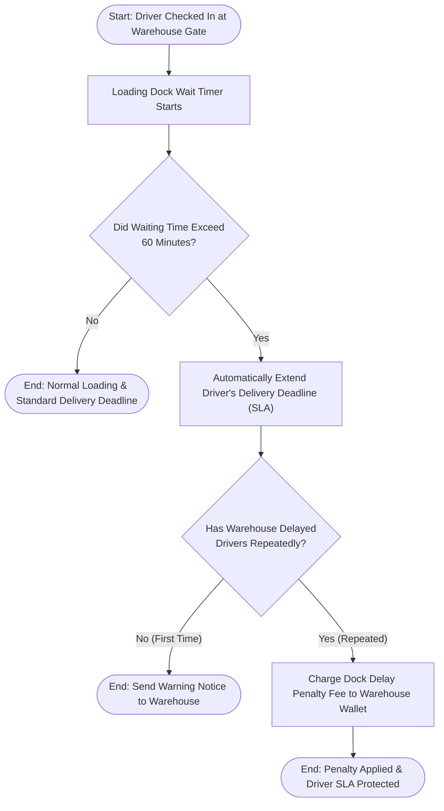
```mermaid
flowchart TD
    Start(["Start: Driver Checked In at Warehouse Gate"]) --> WaitTimer["Loading Dock Wait Timer Starts"]
    WaitTimer --> Delayed{"Did Waiting Time Exceed\n60 Minutes?"}
    Delayed -->|"No"| EndNormalLoad(["End: Normal Loading & Standard Delivery Deadline"])
    Delayed -->|"Yes"| ExtendSLA["Automatically Extend Driver's Delivery Deadline (SLA)"]
    ExtendSLA --> RepeatCheck{"Has Warehouse Delayed\nDrivers Repeatedly?"}
    RepeatCheck -->|"No (First Time)"| EndWarn(["End: Send Warning Notice to Warehouse"])
    RepeatCheck -->|"Yes (Repeated)"| ChargePenalty["Charge Dock Delay Penalty Fee to Warehouse Wallet"]
    ChargePenalty --> EndPenalized(["End: Penalty Applied & Driver SLA Protected"])
```

---

### Flow 8: Loading Bay Count — Exact Match vs. Count Disagreement
How the warehouse and driver agree on the number of packages loaded into the vehicle.

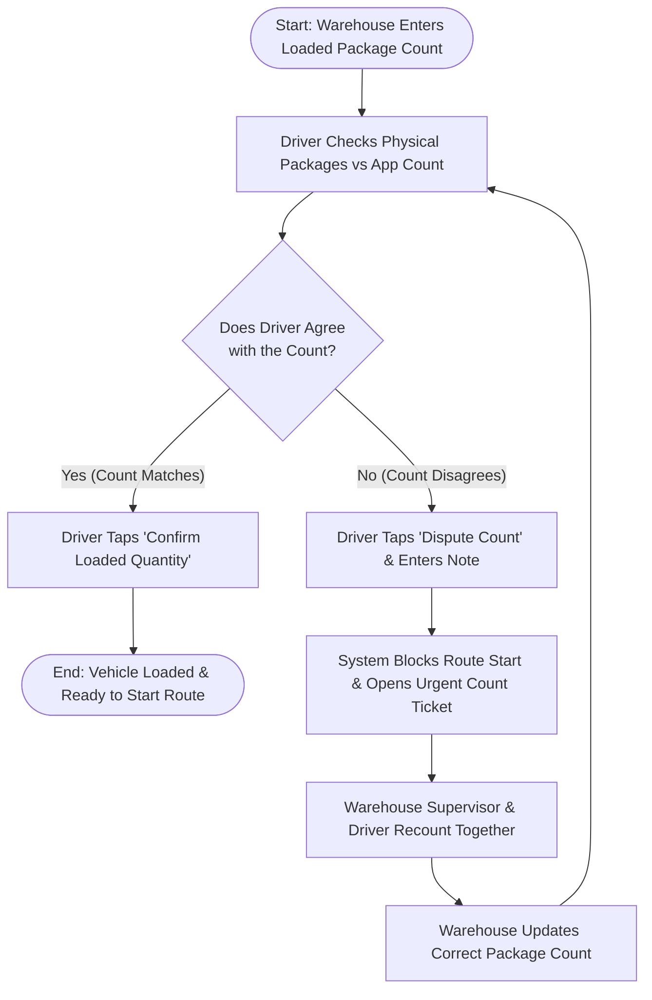
```mermaid
flowchart TD
    Start(["Start: Warehouse Enters Loaded Package Count"]) --> DriverReview["Driver Checks Physical Packages vs App Count"]
    DriverReview --> AgreeChoice{"Does Driver Agree\nwith the Count?"}
    AgreeChoice -->|"Yes (Count Matches)"| AckTrue["Driver Taps 'Confirm Loaded Quantity'"]
    AckTrue --> EndReady(["End: Vehicle Loaded & Ready to Start Route"])
    
    AgreeChoice -->|"No (Count Disagrees)"| AckFalse["Driver Taps 'Dispute Count' & Enters Note"]
    AckFalse --> BlockStart["System Blocks Route Start & Opens Urgent Count Ticket"]
    BlockStart --> Recount["Warehouse Supervisor & Driver Recount Together"]
    Recount --> ReEnter["Warehouse Updates Correct Package Count"]
    ReEnter --> DriverReview
```

---

### Flow 9: Loading Bay Shortfall (Warehouse Gives Fewer Packages Than Booked)
For example: The warehouse booked 50 packages, but only has 30 ready when the driver arrives.

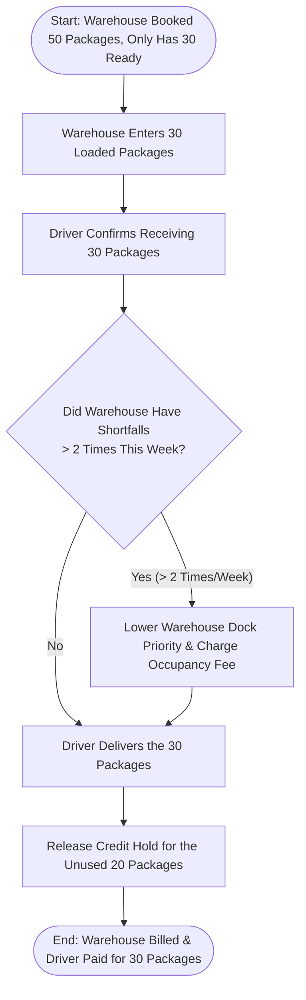
```mermaid
flowchart TD
    Start(["Start: Warehouse Booked 50 Packages, Only Has 30 Ready"]) --> Record30["Warehouse Enters 30 Loaded Packages"]
    Record30 --> DriverAck["Driver Confirms Receiving 30 Packages"]
    DriverAck --> StrikeCheck{"Did Warehouse Have Shortfalls\n> 2 Times This Week?"}
    StrikeCheck -->|"No"| Deliver30["Driver Delivers the 30 Packages"]
    StrikeCheck -->|"Yes (> 2 Times/Week)"| LowerPriority["Lower Warehouse Dock Priority & Charge Occupancy Fee"]
    LowerPriority --> Deliver30
    Deliver30 --> Release20["Release Credit Hold for the Unused 20 Packages"]
    Release20 --> EndSettle30(["End: Warehouse Billed & Driver Paid for 30 Packages"])
```

---

### Flow 10: Loading Bay Extra Packages (Warehouse Has More Packages Than Booked)
For example: The warehouse booked 50 packages, but has 75 ready at the dock.

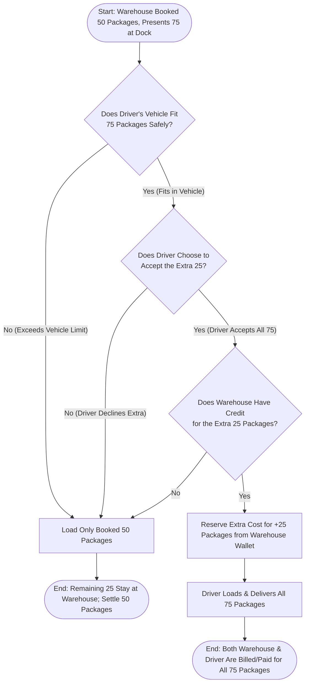
```mermaid
flowchart TD
    Start(["Start: Warehouse Booked 50 Packages, Presents 75 at Dock"]) --> CapacityCheck{"Does Driver's Vehicle Fit\n75 Packages Safely?"}
    CapacityCheck -->|"No (Exceeds Vehicle Limit)"| Cap50["Load Only Booked 50 Packages"]
    Cap50 --> End50(["End: Remaining 25 Stay at Warehouse; Settle 50 Packages"])
    
    CapacityCheck -->|"Yes (Fits in Vehicle)"| DriverChoice{"Does Driver Choose to\nAccept the Extra 25?"}
    DriverChoice -->|"No (Driver Declines Extra)"| Cap50
    DriverChoice -->|"Yes (Driver Accepts All 75)"| CreditCheck{"Does Warehouse Have Credit\nfor the Extra 25 Packages?"}
    CreditCheck -->|"No"| Cap50
    CreditCheck -->|"Yes"| ReserveExtra["Reserve Extra Cost for +25 Packages from Warehouse Wallet"]
    ReserveExtra --> Deliver75["Driver Loads & Delivers All 75 Packages"]
    Deliver75 --> EndSettle75(["End: Both Warehouse & Driver Are Billed/Paid for All 75 Packages"])
```

---

### Flow 11: Physical Equipment Custody Handover & Return
When the warehouse gives the driver reusable items (cold boxes, thermal bags, padlocks) for the shift.

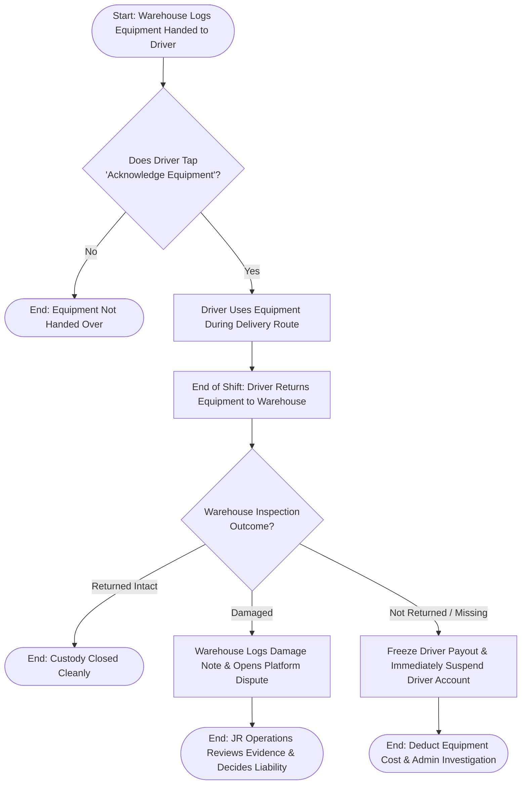
```mermaid
flowchart TD
    Start(["Start: Warehouse Logs Equipment Handed to Driver"]) --> DriverAck{"Does Driver Tap\n'Acknowledge Equipment'?"}
    DriverAck -->|"No"| EndNoHandover(["End: Equipment Not Handed Over"])
    DriverAck -->|"Yes"| UseShift["Driver Uses Equipment During Delivery Route"]
    UseShift --> ReturnDock["End of Shift: Driver Returns Equipment to Warehouse"]
    ReturnDock --> InspectChoice{"Warehouse Inspection\nOutcome?"}
    InspectChoice -->|"Returned Intact"| EndClean(["End: Custody Closed Cleanly"])
    InspectChoice -->|"Damaged"| OpenDispute["Warehouse Logs Damage Note & Opens Platform Dispute"]
    OpenDispute --> EndArbitrate(["End: JR Operations Reviews Evidence & Decides Liability"])
    InspectChoice -->|"Not Returned / Missing"| FreezeSuspend["Freeze Driver Payout & Immediately Suspend Driver Account"]
    FreezeSuspend --> EndInvestigate(["End: Deduct Equipment Cost & Admin Investigation"])
```

---

### Flow 12: Fixed Route Approval & Standard Customer Delivery
How the driver approves the fixed route and completes deliveries (with offline sync support).

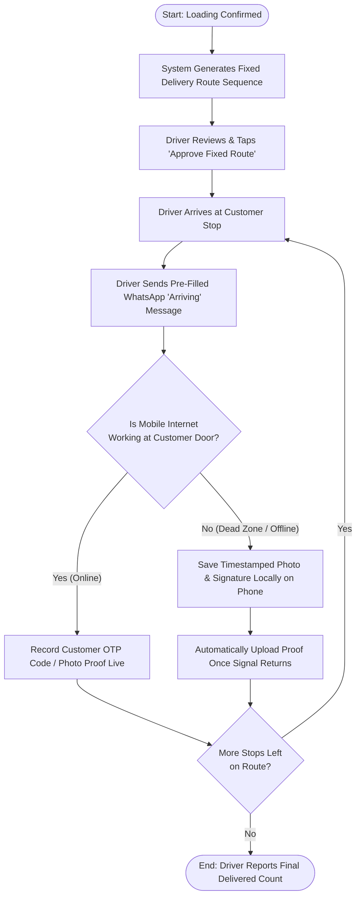
```mermaid
flowchart TD
    Start(["Start: Loading Confirmed"]) --> GenRoute["System Generates Fixed Delivery Route Sequence"]
    GenRoute --> ApproveRoute["Driver Reviews & Taps 'Approve Fixed Route'"]
    ApproveRoute --> DriveStop["Driver Arrives at Customer Stop"]
    DriveStop --> SendWA["Driver Sends Pre-Filled WhatsApp 'Arriving' Message"]
    SendWA --> Handover{"Is Mobile Internet\nWorking at Customer Door?"}
    Handover -->|"Yes (Online)"| EnterOTP["Record Customer OTP Code / Photo Proof Live"]
    Handover -->|"No (Dead Zone / Offline)"| SaveOffline["Save Timestamped Photo & Signature Locally on Phone"]
    SaveOffline --> AutoSync["Automatically Upload Proof Once Signal Returns"]
    EnterOTP --> NextStop{"More Stops Left\non Route?"}
    AutoSync --> NextStop
    NextStop -->|"Yes"| DriveStop
    NextStop -->|"No"| EndRoute(["End: Driver Reports Final Delivered Count"])
```

---

### Flow 13: Customer Unreachable / No Answer (10-Minute Wait Rule)
What the driver must do before marking a customer as unreachable and returning the package.

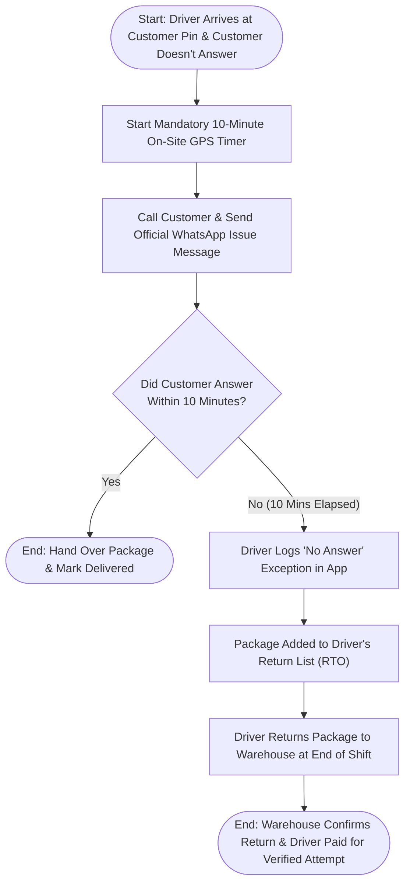
```mermaid
flowchart TD
    Start(["Start: Driver Arrives at Customer Pin & Customer Doesn't Answer"]) --> StartTimer["Start Mandatory 10-Minute On-Site GPS Timer"]
    StartTimer --> ContactAttempt["Call Customer & Send Official WhatsApp Issue Message"]
    ContactAttempt --> Answered{"Did Customer Answer\nWithin 10 Minutes?"}
    Answered -->|"Yes"| EndDelivered(["End: Hand Over Package & Mark Delivered"])
    Answered -->|"No (10 Mins Elapsed)"| LogNoAnswer["Driver Logs 'No Answer' Exception in App"]
    LogNoAnswer --> AddRTO["Package Added to Driver's Return List (RTO)"]
    AddRTO --> ReturnWarehouse["Driver Returns Package to Warehouse at End of Shift"]
    ReturnWarehouse --> EndPaidAttempt(["End: Warehouse Confirms Return & Driver Paid for Verified Attempt"])
```

---

### Flow 14: Customer Refuses Delivery at the Door
When the customer opens the door or answers the phone and refuses to take the shipment.

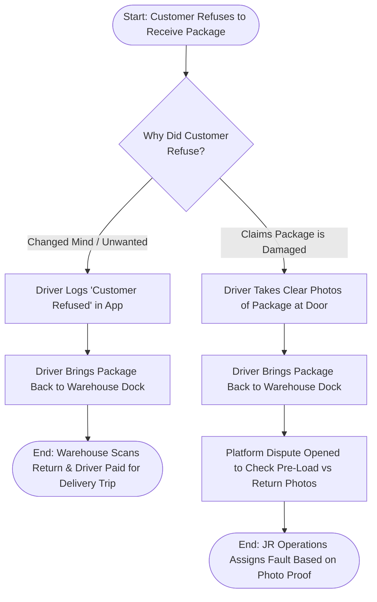
```mermaid
flowchart TD
    Start(["Start: Customer Refuses to Receive Package"]) --> ReasonChoice{"Why Did Customer\nRefuse?"}
    ReasonChoice -->|"Changed Mind / Unwanted"| LogRefused["Driver Logs 'Customer Refused' in App"]
    LogRefused --> ReturnDoc["Driver Brings Package Back to Warehouse Dock"]
    ReturnDoc --> EndNormalRTO(["End: Warehouse Scans Return & Driver Paid for Delivery Trip"])
    
    ReasonChoice -->|"Claims Package is Damaged"| TakePhotos["Driver Takes Clear Photos of Package at Door"]
    TakePhotos --> ReturnDamaged["Driver Brings Package Back to Warehouse Dock"]
    ReturnDamaged --> OpenCase["Platform Dispute Opened to Check Pre-Load vs Return Photos"]
    OpenCase --> EndDisputedRTO(["End: JR Operations Assigns Fault Based on Photo Proof"])
```

---

### Flow 15: Customer Requests Address Change to Another Area Mid-Route
Based on approved management rules: drivers never divert to a new zone mid-route.

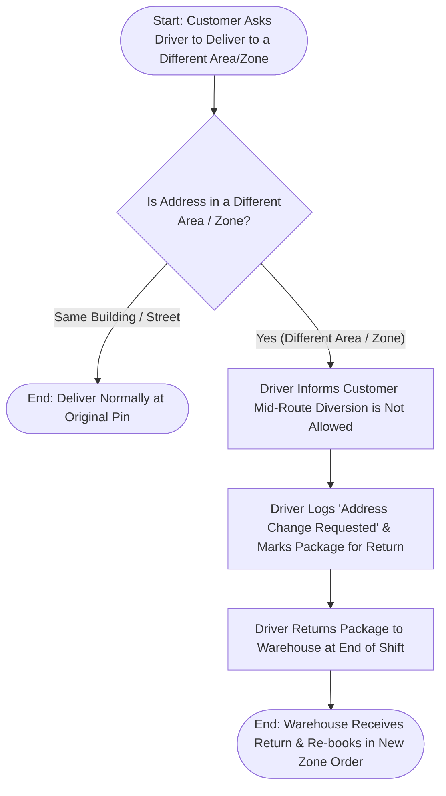
```mermaid
flowchart TD
    Start(["Start: Customer Asks Driver to Deliver to a Different Area/Zone"]) --> RuleCheck{"Is Address in a Different\nArea / Zone?"}
    RuleCheck -->|"Same Building / Street"| EndDeliver(["End: Deliver Normally at Original Pin"])
    RuleCheck -->|"Yes (Different Area / Zone)"| RefuseDivert["Driver Informs Customer Mid-Route Diversion is Not Allowed"]
    RefuseDivert --> MarkRTO["Driver Logs 'Address Change Requested' & Marks Package for Return"]
    MarkRTO --> ReturnWarehouse["Driver Returns Package to Warehouse at End of Shift"]
    ReturnWarehouse --> EndRebook(["End: Warehouse Receives Return & Re-books in New Zone Order"])
```

---

### Flow 16: Out-of-Zone Package Discovered (Wrong Zone Penalty)
When a warehouse includes an address that is outside the agreed zone polygon.

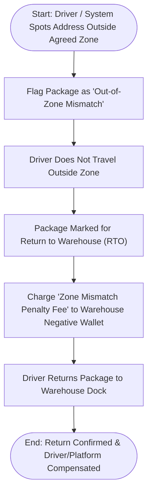
```mermaid
flowchart TD
    Start(["Start: Driver / System Spots Address Outside Agreed Zone"]) --> FlagZone["Flag Package as 'Out-of-Zone Mismatch'"]
    FlagZone --> DoNotDeliver["Driver Does Not Travel Outside Zone"]
    DoNotDeliver --> ReturnOrigin["Package Marked for Return to Warehouse (RTO)"]
    ReturnOrigin --> Penalty["Charge 'Zone Mismatch Penalty Fee' to Warehouse Negative Wallet"]
    Penalty --> Handback["Driver Returns Package to Warehouse Dock"]
    Handback --> EndZoneCase(["End: Return Confirmed & Driver/Platform Compensated"])
```

---

### Flow 17: Missing Security Gate Pass at Port / Compound
When a driver arrives at a restricted port, military base, or compound and the warehouse forgot to provide an entry pass.

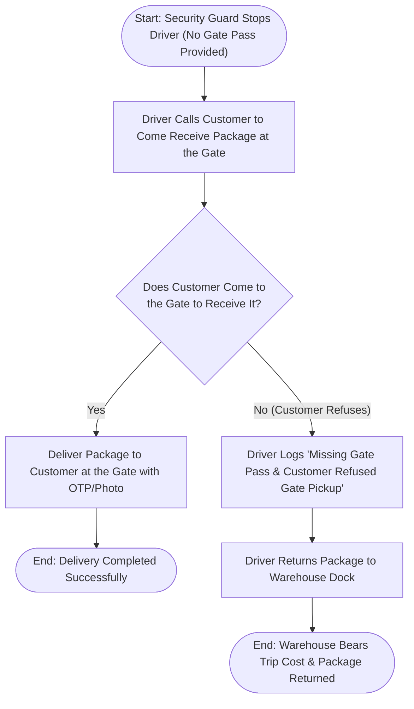
```mermaid
flowchart TD
    Start(["Start: Security Guard Stops Driver (No Gate Pass Provided)"]) --> CallCustomer["Driver Calls Customer to Come Receive Package at the Gate"]
    CallCustomer --> CustomerChoice{"Does Customer Come to\nthe Gate to Receive It?"}
    CustomerChoice -->|"Yes"| HandoverGate["Deliver Package to Customer at the Gate with OTP/Photo"]
    HandoverGate --> EndDeliveredGate(["End: Delivery Completed Successfully"])
    
    CustomerChoice -->|"No (Customer Refuses)"| LogGateException["Driver Logs 'Missing Gate Pass & Customer Refused Gate Pickup'"]
    LogGateException --> ReturnWarehouse["Driver Returns Package to Warehouse Dock"]
    ReturnWarehouse --> EndWarehouseCost(["End: Warehouse Bears Trip Cost & Package Returned"])
```

---

### Flow 18: B2B Multi-Branch Drop-Off ("Milk-Run") Where One Branch Refuses
When a truck delivers pallets/boxes to multiple store branches in one route and one branch refuses its drop.

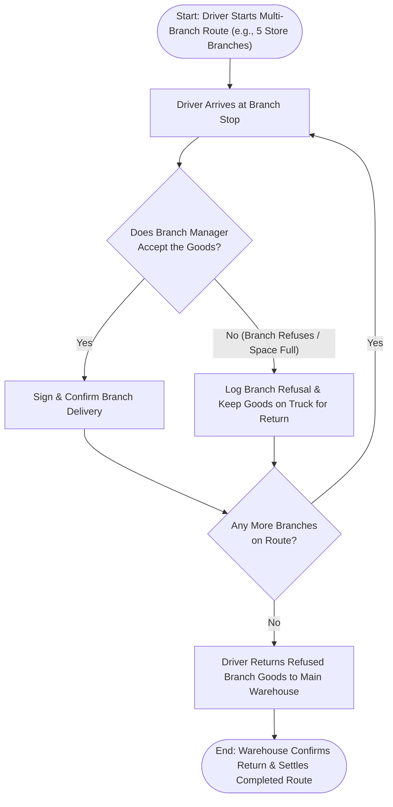
```mermaid
flowchart TD
    Start(["Start: Driver Starts Multi-Branch Route (e.g., 5 Store Branches)"]) --> VisitBranch["Driver Arrives at Branch Stop"]
    VisitBranch --> BranchChoice{"Does Branch Manager\nAccept the Goods?"}
    BranchChoice -->|"Yes"| ConfirmStop["Sign & Confirm Branch Delivery"]
    BranchChoice -->|"No (Branch Refuses / Space Full)"| LogBranchRTO["Log Branch Refusal & Keep Goods on Truck for Return"]
    ConfirmStop --> MoreBranches{"Any More Branches\non Route?"}
    LogBranchRTO --> MoreBranches
    MoreBranches -->|"Yes"| VisitBranch
    MoreBranches -->|"No"| ReturnRefused["Driver Returns Refused Branch Goods to Main Warehouse"]
    ReturnRefused --> EndMilkRun(["End: Warehouse Confirms Return & Settles Completed Route"])
```

---

### Flow 19: Mid-Shift Vehicle Breakdown or Medical Emergency (Office vs. Freelancer)
How the platform handles a breakdown on the road depending on whether the driver belongs to an office or works independently.

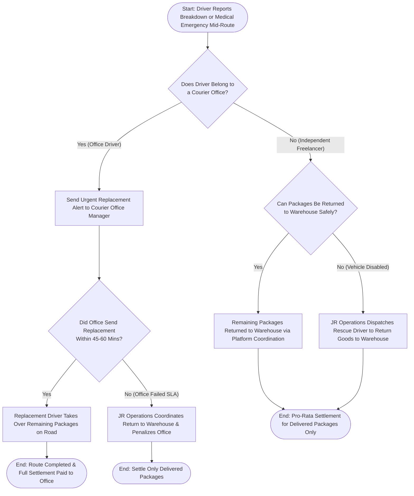
```mermaid
flowchart TD
    Start(["Start: Driver Reports Breakdown or Medical Emergency Mid-Route"]) --> DriverType{"Does Driver Belong to\na Courier Office?"}
    
    DriverType -->|"Yes (Office Driver)"| AlertOffice["Send Urgent Replacement Alert to Courier Office Manager"]
    AlertOffice --> OfficeSent{"Did Office Send Replacement\nWithin 45-60 Mins?"}
    OfficeSent -->|"Yes"| HandoverLoad["Replacement Driver Takes Over Remaining Packages on Road"]
    HandoverLoad --> EndOfficeFinish(["End: Route Completed & Full Settlement Paid to Office"])
    OfficeSent -->|"No (Office Failed SLA)"| PlatformCoordinate["JR Operations Coordinates Return to Warehouse & Penalizes Office"]
    PlatformCoordinate --> EndPartialSettle(["End: Settle Only Delivered Packages"])
    
    DriverType -->|"No (Independent Freelancer)"| CanReturn{"Can Packages Be Returned\nto Warehouse Safely?"}
    CanReturn -->|"Yes"| ReturnToDock["Remaining Packages Returned to Warehouse via Platform Coordination"]
    CanReturn -->|"No (Vehicle Disabled)"| OpsRescue["JR Operations Dispatches Rescue Driver to Return Goods to Warehouse"]
    ReturnToDock --> EndProRata(["End: Pro-Rata Settlement for Delivered Packages Only"])
    OpsRescue --> EndProRata
```

---

### Flow 20: Refrigerated Truck (Reefer) Cooling Failure Mid-Route
What happens when a cold-chain truck's cooling unit stops working during delivery.

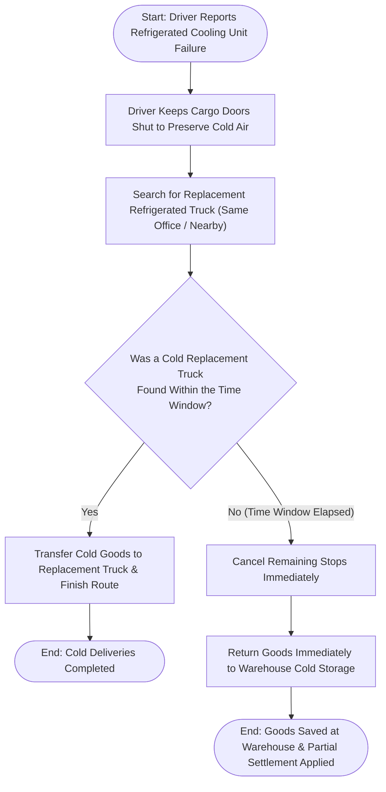
```mermaid
flowchart TD
    Start(["Start: Driver Reports Refrigerated Cooling Unit Failure"]) --> KeepClosed["Driver Keeps Cargo Doors Shut to Preserve Cold Air"]
    KeepClosed --> FindCold["Search for Replacement Refrigerated Truck (Same Office / Nearby)"]
    FindCold --> FoundInTime{"Was a Cold Replacement Truck\nFound Within the Time Window?"}
    FoundInTime -->|"Yes"| TransferCold["Transfer Cold Goods to Replacement Truck & Finish Route"]
    TransferCold --> EndColdSaved(["End: Cold Deliveries Completed"])
    
    FoundInTime -->|"No (Time Window Elapsed)"| AbortRoute["Cancel Remaining Stops Immediately"]
    AbortRoute --> ReturnColdDock["Return Goods Immediately to Warehouse Cold Storage"]
    ReturnColdDock --> EndColdRTO(["End: Goods Saved at Warehouse & Partial Settlement Applied"])
```

---

### Flow 21: Early vs. Late Order Cancellation by the Warehouse
How cancellations work depending on whether the driver has already arrived at the warehouse gate.

```mermaid
flowchart TD
    Start(["Start: Warehouse Requests to Cancel Order"]) --> WorkState{"Have Deliveries Already Been\nCompleted / Reported?"}
    WorkState -->|"Yes"| EndCannotCancel(["End: Cancellation Blocked (Must Settle Completed Work)"])
    WorkState -->|"No"| DriverArrived{"Has Driver Already Arrived\nat Warehouse Gate (GPS)?"}
    
    DriverArrived -->|"No (Cancelled Early)"| NotifyDrivers["Notify Assigned Drivers Not to Come"]
    NotifyDrivers --> Release100["Release 100% of Reserved Money Back to Warehouse Wallet"]
    Release100 --> EndFreeCancel(["End: Order Cancelled with Zero Fee"])
    
    DriverArrived -->|"Yes (Driver Already at Gate)"| OpsVerify["JR Operations Confirms Cancellation After Driver Arrival"]
    OpsVerify --> ChargeShowUp["Charge 'Show-Up Compensation Fee' to Warehouse Wallet"]
    ChargeShowUp --> PayDriver["Credit Compensation Fee to Driver/Office & Release Remaining Hold"]
    PayDriver --> EndCompCancel(["End: Order Cancelled with Driver Compensated"])
```

---

### Flow 22: Driver Self-Cancellation & 3-Strike Auto-Suspension (With Admin Reactivation)
What happens when a driver cancels an accepted job before picking up packages.

```mermaid
flowchart TD
    Start(["Start: Driver Cancels Accepted Job"]) --> FreeSlot["Remove Driver & Immediately Send Job to Replacement Drivers"]
    FreeSlot --> CountStrikes["Add 1 Strike to Driver's Rolling Cancellation Record"]
    CountStrikes --> StrikeLevel{"How Many Strikes Does\nDriver Have Now?"}
    StrikeLevel -->|"1 Strike"| EndRecord(["End: Strike Recorded"])
    StrikeLevel -->|"2 Strikes"| EndWarn(["End: Send Official Warning Notification to Driver"])
    StrikeLevel -->|"3 Strikes"| AutoSuspend["Automatically Suspend Driver Account for 7 Days"]
    AutoSuspend --> ValidExcuse{"Did Driver Submit Proof of\nValid Emergency to Admin?"}
    ValidExcuse -->|"No"| EndWait7(["End: Driver Automatically Unsuspended After 7 Days"])
    ValidExcuse -->|"Yes"| AdminOverride["Platform Admin Clicks 'Manual Reactivate / Clear Suspension'"]
    AdminOverride --> EndRestored(["End: Driver Account Restored Immediately & Strikes Reset"])
```

---

### Flow 23: Driver No-Show at Warehouse Gate (> 15 Minutes Late)
What happens when a driver accepts a job but never shows up at the loading dock.

```mermaid
flowchart TD
    Start(["Start: Shift Start Time Passes + 15-Minute Grace Window"]) --> DriverHere{"Did Driver Check In via GPS\nat Warehouse Gate?"}
    DriverHere -->|"Yes"| EndPresent(["End: Driver Present (Proceed to Loading)"])
    DriverHere -->|"No"| MarkNoShow["Warehouse / Operations Marks Driver as 'No-Show'"]
    MarkNoShow --> ZeroPay["Driver Receives 0 SAR + 1 Strike Added to Record"]
    ZeroPay --> AutoReplace["System Automatically Sends Urgent Replacement Offers"]
    AutoReplace --> ReplacementFound{"Did a Replacement Driver\nAccept?"}
    ReplacementFound -->|"Yes"| EndReplaced(["End: Replacement Driver Heads to Warehouse"])
    ReplacementFound -->|"No"| EndOpsAlert(["End: Critical Alert Flashes on JR Operations Dashboard"])
```

---

### Flow 24: Courier Office Replaces Its Own Driver Before Shift Starts
When a courier office manager needs to swap one of their assigned drivers for another driver in their fleet.

```mermaid
flowchart TD
    Start(["Start: Office Manager Taps 'Replace Driver' on Upcoming Job"]) --> HasStarted{"Has the Driver Already\nStarted Loading?"}
    HasStarted -->|"Yes"| EndNeedOps(["End: Must Contact JR Operations for Mid-Shift Replacement"])
    HasStarted -->|"No"| MarkReplaced["Current Driver Marked as 'Replaced'"]
    MarkReplaced --> OfferSameOffice["System Offers the Slot to Other Eligible Drivers in Same Office First"]
    OfferSameOffice --> SameOfficeTook{"Did Another Driver in\nSame Office Accept?"}
    SameOfficeTook -->|"Yes"| EndInternalSwap(["End: New Office Driver Assigned Smoothly"])
    SameOfficeTook -->|"No"| OpenGeneral["System Opens Slot to All Qualified Drivers on Platform"]
    OpenGeneral --> EndGeneralSwap(["End: Slot Filled from General Pool"])
```

---

### Flow 25: Vehicle with Driver (Daily Shift Service) Flow
How multi-day vehicle-with-driver bookings work (paid per day rather than per package).

```mermaid
flowchart TD
    Start(["Start: Warehouse Books Vehicle + Driver for N Days (e.g., 5 Days)"]) --> ReserveDays["Reserve Total Cost for 5 Vehicle-Days from Warehouse Wallet"]
    ReserveDays --> MatchDriver["Driver Accepts 5-Day Shift Assignment"]
    MatchDriver --> CheckInDay1["Driver Checks In at Warehouse via GPS on Start Day"]
    CheckInDay1 --> ConfirmAttendance["Warehouse Confirms Driver Attendance"]
    ConfirmAttendance --> WorkDays["Driver Works the Agreed Daily Shift Schedule"]
    WorkDays --> ReportDays["At End of Booking, Driver Reports Completed Days"]
    ReportDays --> WarehouseConfirm{"Does Warehouse Confirm\nthe Completed Days?"}
    WarehouseConfirm -->|"Yes"| EndSettleDays(["End: Create Settlement for Completed Days & Issue Tax Invoice"])
    WarehouseConfirm -->|"No (Disputes Days)"| EndOpsReview(["End: Freeze Payout & Send to JR Operations to Verify Attendance Logs"])
```

---

### Flow 26: Vehicle without Driver (Driverless Fleet Rental) Flow
How pure vehicle rentals work when the warehouse uses its own drivers.

```mermaid
flowchart TD
    Start(["Start: Warehouse Books 'Vehicle Without Driver' (e.g., 3 Vans for 10 Days)"]) --> ReserveRental["Reserve 10-Day Rental Cost from Warehouse Wallet"]
    ReserveRental --> InstantConfirm["Order Status Immediately Moves to 'Confirmed' (No Driver Matching)"]
    InstantConfirm --> OpsHandover{"Did Warehouse Cancel\nBefore Vehicle Handover?"}
    OpsHandover -->|"Yes"| EndRefundRental(["End: Cancel Order & Release 100% of Reserved Money"])
    OpsHandover -->|"No (Vehicles Handed Over)"| StaffFulfil["JR Operations Clicks 'Fulfil Rental'"]
    StaffFulfil --> ChargeWallet["Convert Reserved Hold into Final Charge & Issue ZATCA Invoice"]
    ChargeWallet --> EndRentalDone(["End: Rental Completed"])
```

---

## Part 4: All Platform Management, Fleet, Support & Financial Flows (Flows 27 to 45)

### Flow 27: Mobile Phone SMS Login & New User Registration
```mermaid
flowchart TD
    Start(["Start: User Enters Mobile Number"]) --> SendOTP["System Sends 6-Digit SMS Code"]
    SendOTP --> CodeValid{"Is SMS Code\nCorrect?"}
    CodeValid -->|"No (Wrong Code)"| EndRetry(["End: Show Error (Max 5 Attempts Before Lock)"])
    CodeValid -->|"Yes"| ExistingUser{"Does Phone Number Already\nHave an Account?"}
    ExistingUser -->|"Yes"| ActiveCheck{"Is Account Active\n(Not Suspended)?"}
    ActiveCheck -->|"No"| EndSuspended(["End: Block Login & Show Suspended Message"])
    ActiveCheck -->|"Yes"| EndLoggedIn(["End: User Logged In to Dashboard"])
    ExistingUser -->|"No (New User)"| ChooseRole["User Selects Role (Warehouse / Courier Office / Driver) & Fills Profile"]
    ChooseRole --> EndRegistered(["End: Account & Wallet Created + Sent to Verification Queue"])
```

---

### Flow 28: Staff Login, Brute-Force Lockout & Two-Step Security (MFA)
```mermaid
flowchart TD
    Start(["Start: Staff Enters Email & Password"]) --> LockedCheck{"Is Account Currently\nLocked Out?"}
    LockedCheck -->|"Yes"| EndWaitLock(["End: Blocked for 15 Mins (Or Until Admin Unlocks)"])
    LockedCheck -->|"No"| PassCheck{"Is Password\nCorrect?"}
    PassCheck -->|"No"| CountFail{"5 Failed Attempts\nin a Row?"}
    CountFail -->|"No"| EndWrongPass(["End: Show Invalid Credentials"])
    CountFail -->|"Yes"| Lock15["Lock Staff Account for 15 Minutes"] --> EndWaitLock
    PassCheck -->|"Yes"| MfaEnabled{"Is Two-Step Verification\n(MFA) Enabled?"}
    MfaEnabled -->|"No"| EndStaffIn(["End: Staff Logged In to Backoffice"])
    MfaEnabled -->|"Yes"| AskMfa["Prompt for 6-Digit Authenticator Code (or Recovery Code)"]
    AskMfa --> MfaValid{"Is MFA Code\nValid?"}
    MfaValid -->|"No"| EndMfaFail(["End: Access Denied"])
    MfaValid -->|"Yes"| EndStaffIn
```

---

### Flow 29: Warehouse Verification & Negative Wallet Setup
```mermaid
flowchart TD
    Start(["Start: New Warehouse Uploads CR & VAT Documents"]) --> StaffReview["JR Verification Staff Reviews Documents in Queue"]
    StaffReview --> ReviewChoice{"Staff Verification\nDecision?"}
    ReviewChoice -->|"Reject"| EndRejected(["End: Account Rejected with Reason Sent to Warehouse"])
    ReviewChoice -->|"Request More Info"| AskInfo["Notify Warehouse to Re-upload Clearer Documents"]
    AskInfo --> StaffReview
    ReviewChoice -->|"Approve (Verify)"| SetCredit["Set Negative Wallet Credit Limit, Billing Cycle & Package Rules"]
    SetCredit --> EndBizReady(["End: Warehouse Verified & Ready to Publish Orders"])
```

---

### Flow 30: Courier Office Verification & Commercial Agreement Acceptance
```mermaid
flowchart TD
    Start(["Start: New Courier Office Uploads CR, TGA License & IBAN"]) --> VerifyDocs{"Does JR Staff Approve\nOffice Documents?"}
    VerifyDocs -->|"No"| EndAskFix(["End: Request Updated Documents from Office"])
    VerifyDocs -->|"Yes"| SendContract["JR Staff Marks Office Verified & Sends Digital Commercial Agreement"]
    SendContract --> OfficeSign{"Does Office Manager Click\n'Accept Agreement'?"}
    OfficeSign -->|"No (Not Yet)"| EndWaitSign(["End: Office Fleet Remains Locked Until Agreement is Accepted"])
    OfficeSign -->|"Yes"| EndOfficeActive(["End: Office & Its Verified Drivers Unlocked to Take Jobs"])
```

---

### Flow 31: Automatic Daily Driver Document Expiry Check
```mermaid
flowchart TD
    Start(["Start: Daily Midnight Document Check Runs"]) --> CheckDocs["Inspect Expiry Dates of All Drivers' ID, License & Vehicle Reg"]
    CheckDocs --> ExpiredToday{"Did Any Required Document\nExpire Today?"}
    ExpiredToday -->|"No"| EndAllValid(["End: Driver Remains 'Verified' & Active"])
    ExpiredToday -->|"Yes"| FlipExpired["Automatically Change Driver Status to 'Expired'"]
    FlipExpired --> BlockJobs["Block Driver from Receiving or Accepting New Orders"]
    BlockJobs --> NotifyUpload["Send Alert to Driver to Upload Renewed Document"]
    NotifyUpload --> ReUpload{"Did Driver Upload & Staff\nApprove Renewed Document?"}
    ReUpload -->|"Yes"| EndRestored(["End: Driver Status Automatically Returns to 'Verified'"])
    ReUpload -->|"No"| BlockJobs
```

---

### Flow 32: Courier Office Invites & Links a Driver by Phone
```mermaid
flowchart TD
    Start(["Start: Verified Office Enters Driver's Phone Number"]) --> ValidTarget{"Is Phone Already Linked\nto Another Office?"}
    ValidTarget -->|"Yes"| EndConflict(["End: Blocked (Driver Must Unlink from Other Office First)"])
    ValidTarget -->|"No"| SendInvite["Create Pending Office Invitation for That Phone Number"]
    SendInvite --> DriverAccept{"Does Driver Tap\n'Accept Invitation'?"}
    DriverAccept -->|"No (Declines)"| EndDeclined(["End: Invitation Closed (Driver Stays Independent)"])
    DriverAccept -->|"Yes"| BusyCheck{"Does Driver Have an Active\nJob Right Now?"}
    BusyCheck -->|"Yes"| EndWaitJob(["End: Ask Driver to Finish Active Job Before Linking"])
    BusyCheck -->|"No"| LinkDriver["Link Driver to Office & Clear Any Old Unaccepted Offers"]
    LinkDriver --> EndLinked(["End: Driver Linked (Future Earnings Route 100% to Office Wallet)"])
```

---

### Flow 33: Unlinking a Driver from a Courier Office
```mermaid
flowchart TD
    Start(["Start: Office Manager or Admin Clicks 'Unlink Driver'"]) --> ActiveJob{"Is Driver Currently Working\non an Active Job?"}
    ActiveJob -->|"Yes"| EndBlockedUnlink(["End: Cannot Unlink Until Active Job Finishes"])
    ActiveJob -->|"No"| ConvertDirect["Remove Office Link & Convert Driver to Independent Freelancer"]
    ConvertDirect --> ClearOffers["Expire Unaccepted Office Offers on Driver's Phone"]
    ClearOffers --> EndIndependent(["End: Driver Now Independent (Future Earnings Go to Driver's Own Wallet)"])
```

---

### Flow 34: Pricing Rule Creation & Automatic Version Retirement
```mermaid
flowchart TD
    Start(["Start: Admin Enters New Price Rule (Customer Price & Provider Cost)"]) --> MarginCheck{"Is Provider Cost Higher\nThan Customer Price?"}
    MarginCheck -->|"Yes"| EndBadPrice(["End: Blocked (Provider Cost Cannot Exceed Customer Price)"])
    MarginCheck -->|"No"| ExistingRule{"Does an Active Rule Already Exist\nfor Same Route/Vehicle/Warehouse?"}
    ExistingRule -->|"No"| CreateV1["Save New Rule as Version 1 (Active)"]
    ExistingRule -->|"Yes"| RetireOld["Automatically Mark Old Rule as 'Retired' (Kept for Old Orders)"]
    RetireOld --> CreateNext["Save New Rule as Next Version (Active)"]
    CreateV1 --> EndPriceLive(["End: New Pricing Live for Future Orders"])
    CreateNext --> EndPriceLive
```

---

### Flow 35: Negative Wallet Credit Cycle & Automatic Credit Lockout
```mermaid
flowchart TD
    Start(["Start: Postpaid Warehouse Uses Negative Wallet for Orders"]) --> TrackBalance["Each Order Deducts from Available Balance Down Toward Credit Limit"]
    TrackBalance --> LimitOrOverdue{"Did Balance Hit Max Credit Limit\nOR Is Invoice Overdue > 5 Days?"}
    LimitOrOverdue -->|"No"| EndKeepWorking(["End: Warehouse Continues Creating Orders Normally"])
    LimitOrOverdue -->|"Yes"| LockAccount["Trigger 'Automated Credit Lockout' on Warehouse Account"]
    LockAccount --> BlockNew["Block New Order Creation (Active Road Jobs Continue Normally)"]
    BlockNew --> PayBill{"Did Warehouse Pay\nIts Due Balance?"}
    PayBill -->|"No"| BlockNew
    PayBill -->|"Yes"| UnlockAccount["Credit Limit Restored & Lockout Lifted Automatically"]
    UnlockAccount --> EndKeepWorking
```

---

### Flow 36: Two-Person Finance Settlement Approval (Dual-Control)
```mermaid
flowchart TD
    Start(["Start: Order Completes & Creates 'Pending Review' Settlement"]) --> ComplaintCheck{"Is There an Open Dispute\nHolding This Settlement?"}
    ComplaintCheck -->|"Yes"| EndFrozen(["End: Blocked Until Operations Resolves the Dispute"])
    ComplaintCheck -->|"No"| CountRight{"Is the Final Package\nCount Accurate?"}
    CountRight -->|"No (Mistake Found)"| CorrectCount["Finance Corrects Quantity with Reason & Recalculates Totals"]
    CorrectCount --> Reviewer1["Finance Staff #1 Reviews & Marks 'Reviewed'"]
    CountRight -->|"Yes"| Reviewer1
    Reviewer1 --> Approver2{"Is Finance Manager #2\na Different Person?"}
    Approver2 -->|"No (Same Person)"| EndDualBlock(["End: Blocked (Approver Must Be Different from Reviewer)"])
    Approver2 -->|"Yes"| MarkApproved["Settlement Marked 'Approved' & Ready for Payout"]
    MarkApproved --> EndReadyPay(["End: Queued for Next Payout Batch"])
```

---

### Flow 37: Batch Payouts to Courier Offices & Freelance Drivers
```mermaid
flowchart TD
    Start(["Start: Finance Clicks 'Run Payout Batch'"]) --> PickApproved["Select All 'Approved' Settlements"]
    PickApproved --> LoopItem["Process Each Settlement in Its Own Safe Transaction"]
    LoopItem --> StillClean{"Did a New Dispute Freeze\nThis Item?"}
    StillClean -->|"Yes"| SkipItem["Skip Item for Now (Keep Rest of Batch Moving)"]
    StillClean -->|"No"| ChargeBiz["Release Warehouse Hold & Finalize Warehouse Charge"]
    ChargeBiz --> PayeeChoice{"Who Performed\nthe Job?"}
    PayeeChoice -->|"Office-Linked Driver"| CreditOffice["Credit 100% of Provider Payout to Courier Office Wallet"]
    PayeeChoice -->|"Independent Freelancer"| CreditDriver["Credit 100% of Provider Payout to Driver's Personal Wallet"]
    CreditOffice --> CreditMargin["Credit Commission Margin to JR Platform Account & Issue ZATCA Invoice"]
    CreditDriver --> CreditMargin
    SkipItem --> EndBatch(["End: Batch Summary Saved & Payees Notified"])
    CreditMargin --> EndBatch
```

---

### Flow 38: Bank IBAN Withdrawal & Bounced Transfer Handling
```mermaid
flowchart TD
    Start(["Start: Office or Freelancer Requests Bank Withdrawal"]) --> CheckMin{"Is Amount Above Minimum\n& Is IBAN Valid (SA...)?"}
    CheckMin -->|"No"| EndInvalidWD(["End: Withdrawal Blocked (Fix IBAN or Amount)"])
    CheckMin -->|"Yes"| HoldFunds["Move Money from 'Available' to 'Held' Balance"]
    HoldFunds --> FinanceTransfer["Finance Sends Bank Wire Transfer"]
    FinanceTransfer --> BankResult{"Did the Bank Transfer\nSucceed?"}
    BankResult -->|"Yes (Succeeded)"| EnterRef["Finance Enters Bank Reference & Marks 'Paid'"]
    EnterRef --> EndDeductHeld(["End: Held Balance Cleared & User Notified"])
    
    BankResult -->|"No (Bounced / Wrong IBAN)"| MarkRejected["Finance Marks Withdrawal 'Rejected' with Note"]
    MarkRejected --> ReturnAvail["Money Automatically Moves from 'Held' Back to 'Available' Wallet"]
    ReturnAvail --> EndSafeReturn(["End: Zero Money Lost; User Updates IBAN to Retry"])
```

---

### Flow 39: ZATCA Tax Invoicing & Credit Notes Flow
```mermaid
flowchart TD
    Start(["Start: Settlement is Paid"]) --> CalcVAT["Calculate Subtotal + 15% VAT Breakdown"]
    CalcVAT --> GenInvoice["Generate Sequential Tax Invoice (e.g., INV-000125) for Warehouse"]
    GenInvoice --> LaterChange{"Was the Invoiced Order Later\nCancelled or Reduced?"}
    LaterChange -->|"No"| EndInvoiceFinal(["End: Tax Invoice Finalized in Warehouse Portal"])
    LaterChange -->|"Yes"| IssueCreditNote["Generate Official ZATCA Credit Note Linked to Original Invoice"]
    IssueCreditNote --> AdjustWallet["Credit the Adjusted Amount Back to Warehouse Wallet"]
    AdjustWallet --> EndAdjusted(["End: Tax Records & Wallet Balance Reconciled"])
```

---

### Flow 40: Formal Dispute & Partial Payout Freeze
```mermaid
flowchart TD
    Start(["Start: Warehouse or Driver Files Formal Complaint on a Job"]) --> MoneyImpact{"Does Complaint Involve\nQuantity, Damage, or Custody?"}
    MoneyImpact -->|"No (General Feedback)"| NormalTicket["Assign to Support Staff Without Freezing Money"]
    NormalTicket --> EndNormalResolve(["End: Support Investigates & Closes Complaint"])
    
    MoneyImpact -->|"Yes"| FreezeJob["Turn On 'Settlement Hold' for This Specific Job Only"]
    FreezeJob --> OtherJobs["Other Unrelated Jobs for Same Driver/Office Get Paid Normally"]
    OtherJobs --> OpsReview["Operations Reviews GPS Logs, Timestamps & Photos from Both Sides"]
    OpsReview --> Ruling{"Who Was at Fault\nin the Dispute?"}
    Ruling -->|"Driver / Office at Fault"| AdjustDown["Adjust Final Quantity/Charge in Warehouse's Favor"]
    Ruling -->|"Warehouse at Fault"| KeepFull["Approve Full Payout in Driver/Office's Favor"]
    AdjustDown --> LiftHold["Lift Settlement Hold & Record Resolution"]
    KeepFull --> LiftHold
    LiftHold --> EndDisputeClosed(["End: Settlement Released for Payout"])
```

---

### Flow 41: In-Job Group Chat Flow
```mermaid
flowchart TD
    Start(["Start: User Sends Message in Job Chat"]) --> JobActive{"Is the Order Still\nActive (Not Completed/Cancelled)?"}
    JobActive -->|"No"| EndChatClosed(["End: Chat is Read-Only After Job Closes"])
    JobActive -->|"Yes"| SaveMsg["Save Message to Job Thread"]
    SaveMsg --> NotifyParties["Send Instant Notification to Warehouse, Driver & Office"]
    NotifyParties --> EndDeliveredMsg(["End: All Parties on the Job See the Message"])
```

---

### Flow 42: Urgent Help & Support Ticket Escalation
```mermaid
flowchart TD
    Start(["Start: Warehouse, Driver, or Office Opens Support Ticket"]) --> IsUrgent{"Is Category Critical?\n(No-Show / Not Ready / No Work / Urgent)?"}
    IsUrgent -->|"Yes"| PriorityUrgent["Mark Priority 'Urgent' & Flash Immediate Alert to Operations"]
    IsUrgent -->|"No"| PriorityNormal["Mark Priority 'Normal' & Place in Support Queue"]
    PriorityUrgent --> StaffReply["Support Staff Replies (Public Reply to User or Internal Staff Note)"]
    PriorityNormal --> StaffReply
    StaffReply --> Solved{"Is the Issue\nResolved?"}
    Solved -->|"No"| StaffReply
    Solved -->|"Yes"| EndTicketClosed(["End: Ticket Marked 'Resolved'"])
```

---

### Flow 43: Mutual 5-Star Rating After Job Completion
```mermaid
flowchart TD
    Start(["Start: Driver or Warehouse Taps 'Rate Job' (1 to 5 Stars)"]) --> IsDone{"Is the Job Marked\n'Completed'?"}
    IsDone -->|"No"| EndWaitDone(["End: Rating Blocked Until Job Completes"])
    IsDone -->|"Yes"| AlreadyRated{"Did This User Already\nRate This Job?"}
    AlreadyRated -->|"Yes"| EndDupRate(["End: Blocked (Only One Rating Allowed Per Job)"])
    AlreadyRated -->|"No"| SaveStars["Save 1-5 Star Rating & Optional Comment"]
    SaveStars --> UpdateAvg["Update Recipient's Overall Average Rating Score"]
    UpdateAvg --> EndRated(["End: Rating Published & Used in Future Matching Scores"])
```

---

### Flow 44: External Warehouse ERP Order Sync & Webhook Updates
```mermaid
flowchart TD
    Start(["Start: Warehouse ERP Sends Order via API Key"]) --> KeyValid{"Is API Key Valid\n& Within Rate Limit?"}
    KeyValid -->|"No"| EndApiDenied(["End: Reject API Call (401 / 429)"])
    KeyValid -->|"Yes"| DupCheck{"Was This Same Request ID\nAlready Sent Before?"}
    DupCheck -->|"Yes (Network Retry)"| EndReturnSaved(["End: Return Original Order Response Without Double-Booking"])
    DupCheck -->|"No (New Order)"| CreatePublish["Create & Publish Order Automatically"]
    CreatePublish --> SendWebhook["Whenever Status Changes, Send Signed Webhook to Warehouse Server"]
    SendWebhook --> WebhookOk{"Did Warehouse Server\nRespond 200 OK?"}
    WebhookOk -->|"Yes"| EndSynced(["End: Warehouse ERP Updated in Real Time"])
    WebhookOk -->|"No (Server Down)"| Retry5["Retry Automatically 5 Times (1m, 5m, 30m, 2h, 6h)"]
    Retry5 --> EndDeadLetter(["End: Log Failed Delivery in Webhook Dashboard for Review"])
```

---

### Flow 45: Live Operations Alert Radar & Driver Map Privacy Flow
```mermaid
flowchart TD
    Start(["Start: JR Operations Opens Live Control Tower"]) --> ScanRisks["System Scans All Active Today Jobs & Driver Locations"]
    ScanRisks --> CheckDriverStatus{"Is Driver 'Available'\nor on an Active Job?"}
    CheckDriverStatus -->|"No (Off-Duty)"| HidePin["Wipe Driver Location for Privacy"]
    CheckDriverStatus -->|"Yes"| ShowPin["Show Driver Pin on Live Map (Log Staff View in Audit Trail)"]
    HidePin --> CheckAlerts{"Any SLA Delays, Unfilled Slots,\nDisputes, or Expiring Docs?"}
    ShowPin --> CheckAlerts
    CheckAlerts -->|"No"| EndGreen(["End: Dashboard Shows All Operations Running On Time"])
    CheckAlerts -->|"Yes"| RankAlerts["Sort Alerts by Severity: Critical -> Warning -> Info"]
    RankAlerts --> OpsAction["Operations Takes One-Click Action (Rematch / Assign / Resolve)"]
    OpsAction --> EndResolved(["End: Operational Bottleneck Cleared"])
```
